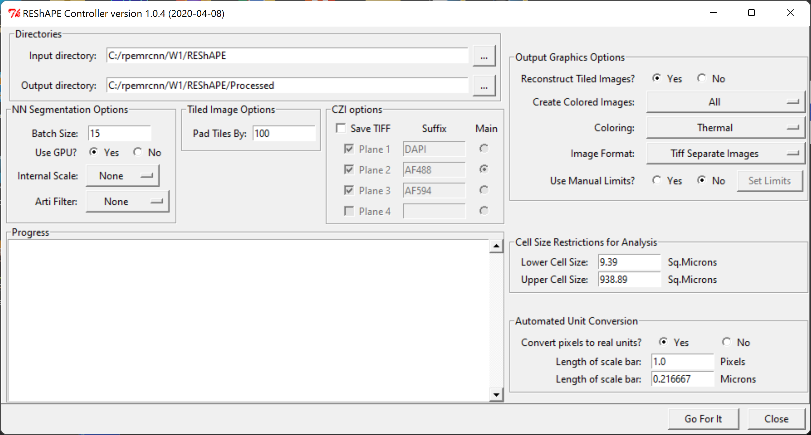
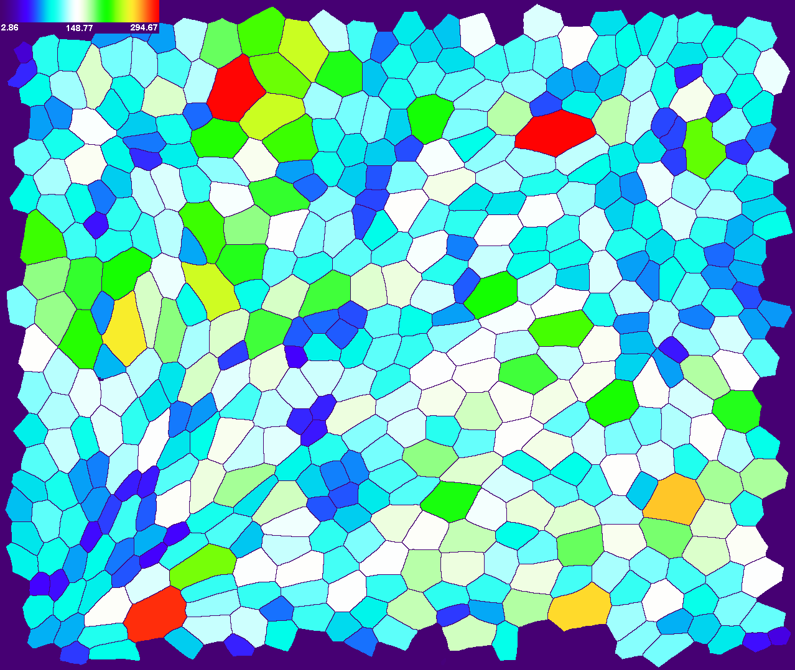

# REShAPE
Image Analysis and Cell Morphometry Measurements on Retinal Pigment Epithelium cells.

*Andrei Volkov, Kapil Bharti, Davide Ortolan, Arvydas Maminishkis (NEI/NIH)*

REShAPE software consists of 3 major parts. First, segmentation (detection of cell borders) is based on trained CNN (convolutional neural networks), implemented using [MatConvNet](https://www.vlfeat.org/matconvnet/), a 3rd party plug-in for Matlab. Second, a [Fiji](https://imagej.net/Fiji) script that accepts segmented images from Matlab/MatconvNet, detects cells and computes a set of geometrical parameters such as area, perimeter, major/minor ellipsis axes, etc. Third, a custom C++ application that accepts Fiji output, calculates the number of neighbors for each cell, computes several additional geometrical parameters dependent on the number of neighbors, and outputs final CSV spreadsheets, as well as a set of color-coded images displaying cells colorized according to their geometrical parameters. Large input images are split into smaller tiles in Matlab, each tile processed separately, then the segmented tiles are recombined into original size image by the custom C++ application. A Python-based GUI envelope is handling the data flow between these separate parts.




REShAPE currently can be built on Linux (Centos 7) and Windows x64 platforms.

## Set-Up instuctions for Centos-7 Linux.

### Pre-requisites for Centos-7

  - Centos-7 Linux OS
  - CUDA-enabled GPU
  - [CUDA toolkit](https://developer.nvidia.com/cuda-downloads) and drivers installed
  - GUI desktop (Gnome or a remote desktop)
  - a user with sudo access

### Centos-7 setup step-by-step

1. Checkout from git to `~/REShAPE` or unzip archive into `~`. Check if Nvidia/CUDA drivers are properly installed:

    `sh ~/REShAPE/Standalone/deviceQuery`

It should print a lengthy output with GPU/driver features and "Result = PASS" at the end. If it prints "Result = FAIL", check your Nvidia/CUDA driver installation -- REShAPE won't work until this problem is fixed.

2. cd to `~/REShAPE` and type

    `python setup.py`

3. Enter your system password when prompted for "sudo password"

4. Wait until setup is complete (it may take a couple of hours). If successful, create desktop icons by typing

    `python setup_icons.py`

5. Once the shortcuts appear on the desktop, click on the desktop (to focus on it) and press F5 to refresh. You should see now the proper names and icon images.

The main application is **REShAPE Controller**.

### Troubleshooting.

If the automatic setup fails to install the Qt5 library, try the following steps:

1. Check if file `/opt/Qt/MaintenanceTool` exists and is executable. If so, run it with sudo:

    `sudo /opt/Qt/MaintenanceTool`

If this file does not exist, delete the directory `/opt/QT`:

`sudo rm -rf /opt/Qt`

then run Qt online installer:

`sudo ~/REShAPE/thirdparty/Qt5/qt-unified-linux-x64-3.1.1-online.run`

2. When the installer starts, follow on screen instructions (mostly, click the "Next" button). On the license acceptance screen, check the *I have read and approve...* box, then click Next. On the **Setup - Qt** screen, select *Add or remove components*, then click Next. On the **Select Components** screen, check *Archive* and click *Filter*. After the tool refreshes the list, expand it (by clicking on *> Qt*), then expand *Qt 5.14.2* and check *Desktop gcc 64 bit*. Then click Next.

3. If successful, go back to the normal installation process starting from step 2 (run `python setup.py`).


## Set-Up instuctions for Windows (x64).

### Pre-requisites for Windows (x64)

  - Python 2.7
  - CUDA-enabled GPU
  - [CUDA toolkit](https://developer.nvidia.com/cuda-downloads) 8.0 (or higher) and drivers installed
  - [Matlab](https://www.mathworks.com/products/matlab.html) R2017a (or higher, R2019b is preferred) with the following toolboxes:
      - Image Processing Toolbox
      - Parallel Computing Toolbox
      - Statistics and Machine Learning Toolbox
  - [Fiji](https://imagej.net/Fiji) (one of the latest versions) installed in `C:\Fiji` or `C:\Fiji.app`
  - [Microsoft Visual Studio](https://www.microsoft.com/en-us/download/developer-tools.aspx) (2017 or higher) w. C/C++ compiler
  - [CMake 3](https://cmake.org)
  - [Rscript](https://cran.r-project.org/) -- only needed for REShAPE Visualizations.

### Windows setup step-by-step

1. Download and install Qt5 open source using [Qt installer](https://www.qt.io/download-qt-installer/). You may need to create an account, but it is free. Only one of the *Qt 5.x, MSVC 2017 64-bit* options is needed. REShAPE has been tested with Qt version 5.14.2, but newer versions might work as well.

2. Download and build [VTK 8.2](https://vtk.org/download/). To build VTK, run CMake with the following options:
	- **VTK_Group_Qt** [BOOL] - checked
	- **Qt5_DIR** [PATH] - point to Qt5's Cmake dir, something like {Qt5_install_dir}/5.14.2/msvc2017_64/lib/cmake/Qt5
	- **VTK_LEGACY_SILENT** [BOOL] - checked

After *Configure* and *Generate*, click *Open Project*, switch to *Release* and build the *ALL_BUILD* target.

3. Download and build [ITK 4.13](https://itk.org/download/). To build ITK, run CMake with the following options:
	- **Module_ITKV3Compatibility** [BOOL] - checked
	- **ITKV3_COMPATIBILITY** [BOOL] - checked
	- **Module_ITKVtkGlue** [BOOL] - checked
	- **Qt5_DIR** [PATH] - point to Qt5's Cmake dir, something like `{Qt5_install_dir}/5.14.2/msvc2017_64/lib/cmake/Qt5`
	- **VTK_DIR** [PATH] - point to VTK build dir

After *Configure* and *Generate*, click *Open Project*, switch to *Release* and build the *ALL_BUILD* target.

4. Check out REShAPE source into a separate directory (e.g. `C:\GitHubNIH\REShAPE`) and build the binary (-ies). The only binary required to run REShAPE is [ReshapeImaging](./cppsource/ReshapeImaging/). To build it, run CMake, point the *source code* to `{C:/GitHubNIH/REShAPE}/cppsource/ReshapeImaging`, and *where to build the binaries*, to
`{C:/GitHubNIH/REShAPE}/cppsource/ReshapeImaging/build`, then specify the following options:
	- **Qt5_DIR** [PATH] - point to Qt5's Cmake dir, something like `{Qt5_install_dir}/5.14.2/msvc2017_64/lib/cmake/Qt5`
	- **VTK_DIR** [PATH] - point to VTK 8 build dir
	- **ITK_DIR** [PATH] - point to ITK 4 build dir
	- **CMAKE_INSTALL_PREFIX** [PATH] - point to `{C:/GitHubNIH/REShAPE}/Imaging`

Click *Configure*, *Generate*, then *Open Project*. Switch to *Release*, build the *ALL_BUILD* target. If successful, also build the *INSTALL* target.

5. (optional) Build **ReshapeViewer** and **RsCircles**. These are separate utilities, not required to run **REShAPE**. If you want to build them anyway, just repeat the build process at step 4, using their respective directories as CMake's *source code*. For **RsCircles**, the **VTK_DIR** and **ITK_DIR** CMake parameters are not needed.

6. Run REShAPE. Go to `{C:\GitHubNIH\REShAPE}` and type `python reshapectl.py`. On the first start, REShAPE runs a self-configuration, which tries to find Matlab, Fiji, etc. and create a config file. If everything goes smooth, this may be all you need. To test installation, set the *Input directory* to `{C:\GitHubNIH\REShAPE}/TestData` and click *Go For It*.

If something goes wrong, check the (automatically generated) REShAPE config file located in `C:\Users\<your-windows-username>\.reshape\config.json`. It should look like this:

```
{
  "matlab_ver": "R2019b", 
  "environ": {
    "+INCLUDE": "C:\\Program Files (x86)\\Windows Kits\\10\\Include\\10.0.17763.0\\ucrt;C:\\Program Files (x86)\\Windows Kits\\10\\Include\\10.0.17763.0\\um;C:\\Program Files (x86)\\Windows Kits\\10\\Include\\10.0.17763.0\\shared", 
    "+PATH": "C:\\Program Files (x86)\\Microsoft Visual Studio\\2017\\Community\\VC\\Tools\\MSVC\\14.16.27023\\bin\\Hostx64\\x64"
  }, 
  "matlab": "C:\\Program Files\\MATLAB\\R2019b\\bin\\matlab.exe", 
  "REShAPE": "REShAPE_Auto_0.0.1.ijm", 
  "matlab_opts": [
    "-wait", 
    "-automation"
  ], 
  "fiji": "C:\\Fiji\\ImageJ-win64.exe", 
  "mex": {
    "enableCudnn": false, 
    "verbose": 1, 
    "EnableImreadJpeg": true, 
    "cudaMethod": "nvcc", 
    "mexFlags": [
      "-R2018a"
    ], 
    "enableGpu": true, 
    "cudaRoot": "C:\\Program Files\\NVIDIA GPU Computing Toolkit\\CUDA\\v11.0"
  }, 
  "cuda_ver": 11.0, 
  "cuda": "C:\\Program Files\\NVIDIA GPU Computing Toolkit\\CUDA\\v11.0"
}
```

Check if variables *matlab*, *fiji*, *cuda* and *cudaRoot* are properly set. If you have Matlab R2019a or higher
and you get errors compiling MatConvNet, try to change `"cudaMethod": "nvcc"` -> `"cudaMethod": "mex"`.

7. (optional) Setup and run REShAPE Visualizations.

If you also want to use REShAPE Visualizations, run `python setup-win64.py` (in `{C:\GitHubNIH\REShAPE}`) first - it will install extra Python libraries required for Visualisations. To run Visualisations itself, type:

`python reshapevis.py`

